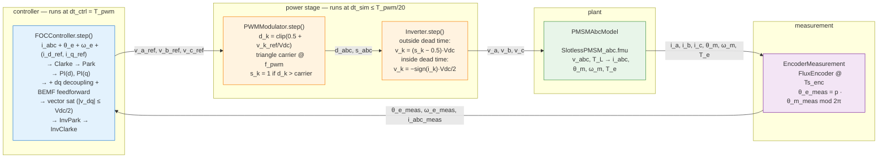
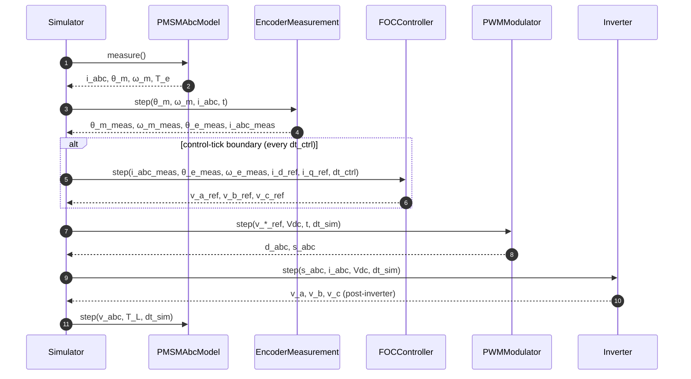
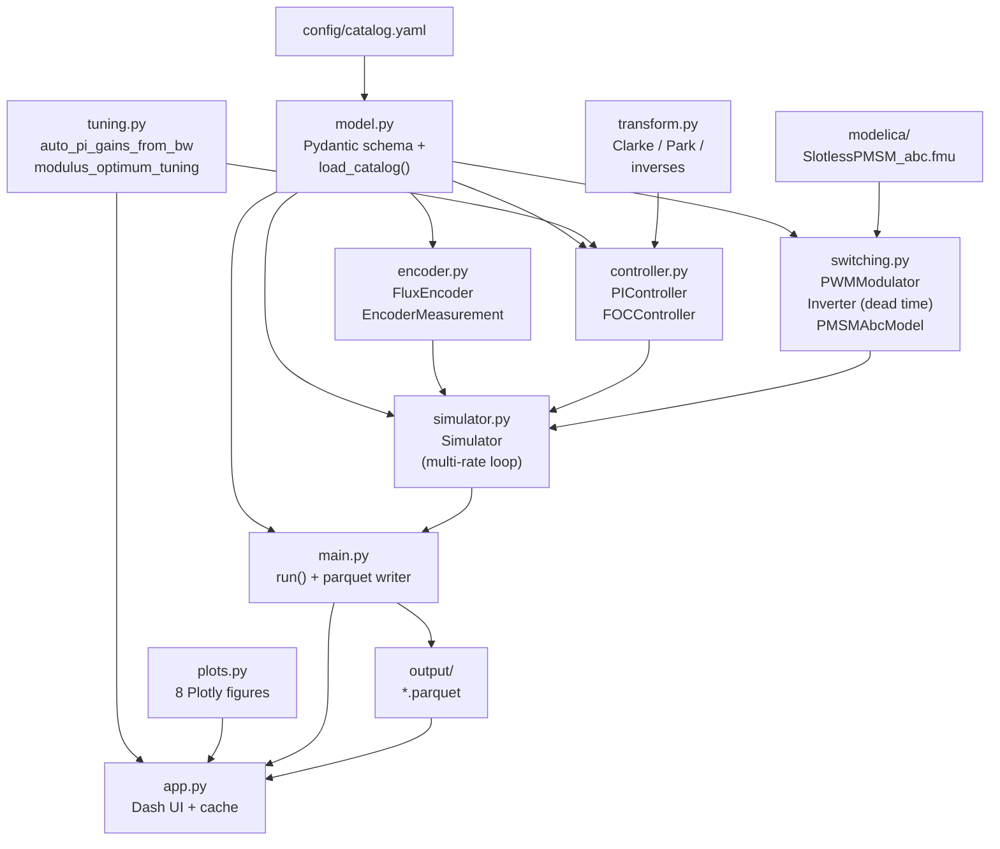

# slimtorq-control

Python-side **Field-Oriented Control (FOC)** for an OpenModelica slotless-PMSM
motor model, with a real **PWM + inverter** in the loop, dead-time emulation,
modulus-optimum / pole-zero-cancellation current-loop tuning, and an
interactive **Dash UI** that drives the simulation and renders the results
from a Polars/Parquet cache.

The motor is parameterised from [config/catalog.yaml](config/catalog.yaml) against the Alva
**SlimTorq** lineup (9 families × ~12 winding configurations ≈ 86 entries).

## Signal chain



## Physical effects modelled

Why this architecture (and not the simpler "FOC outputs continuous v_abc straight to the motor"):

| Effect | Where it's modelled | What you see |
|---|---|---|
| **Switching ripple** in i_abc at f_pwm | Naturally — `Inverter` emits square ±Vdc/2 phase voltages; FMU integrates them. | Triangular ripple of amplitude `≈ Vdc·T_pwm/(8·L_s)` on top of the fundamental current. Drives iron losses, EMI, audible noise, current-sensor bandwidth. |
| **Dead time** (1–3 µs gate-driver blanking) | `Inverter` tracks per-leg t_since_edge; during the t_dead window, freewheel diode clamps v_k = −sign(i_k)·Vdc/2. | 5th + 7th harmonic distortion in i_abc; small low-frequency torque ripple FOC's integrator absorbs. Set `t_dead = 0` to disable. |
| **Vdc utilisation limit** (sinusoidal-PWM linear range `\|v_phase\| ≤ Vdc/2`) | `FOCController` clips `(v_d, v_q)` to magnitude `V_max = Vdc/2` *before* inverse Park. Anti-windup freezes both integrators when the vector saturates. | Beyond the envelope, achievable torque plateaus; the PI-performance plot's `\|v_dq\|` trace clamps at the red line. |
| **dq cross-coupling + BEMF** (`−ω_e·L_s·i_q` on d-axis; `+ω_e·L_s·i_d + ω_e·ψ_m` on q-axis) | `FOCController` adds them as feedforward to the raw PI output (so the per-axis plant the PI sees collapses to a pure R/L circuit; vector saturation acts on the combined PI + FF command). | At high speed the BEMF term `ω_e·ψ_m` dominates v_q; without feedforward the PI integrator absorbs it with tracking lag. With feedforward, i_q tracks immediately and the integrator only handles modelling error. |

## One tick of the inner loop



Between FOC ticks the v_*_ref values are held by ZOH and fed into the PWM every dt_sim, so the modulator + inverter run at the carrier-resolution timescale while the FOC integrates only once per PWM period (the standard digital-FOC convention).

## Modules



| File | Role |
|---|---|
| [modelica/Alva.mo](modelica/Alva.mo) | `SlotlessPMSM_abc`: surface-PM motor, abc external interface, dq internal dynamics on the **true** rotor angle, optional 6th-electrical-harmonic torque ripple. |
| [modelica/build_fmu.mos](modelica/build_fmu.mos) | `omc` build script producing `SlotlessPMSM_abc.fmu`. |
| [config/catalog.yaml](config/catalog.yaml) | Nested family → variant → winding data. Every cell is `{unit, value}` so units are explicit. |
| [src/model.py](src/model.py) | All Pydantic v2 models — catalog-parsing schema, the `MotorSku` + `decode_sku` serial decoder (catalog REV1.8 p.28), the `CatalogMotor` connection-aware computed-field bridge (R_s / L_s / ψ_m / J per p.35), the simulation-facing flat types (`PmsmModel`, `EncoderConfig`, `FocConfig`, `InverterConfig`, `TLRef`), and the catalog loader. `python -m model` exercises the decoder, prints the STM-75-20-L-4Y worked example, then cross-checks every variant against its catalog continuous-torque. |
| [src/tuning.py](src/tuning.py) | Pure functions `auto_pi_gains_from_bw(R, L, bw_hz)` (pole-zero cancellation) and `modulus_optimum_tuning(R, L, f_pwm)` (Leonhard / Schroeder MO). |
| [src/transform.py](src/transform.py) | Amplitude-invariant Clarke / Park + composed `abc_to_dq`, `dq_to_abc`. `python transform.py` round-trip self-test. |
| [src/controller.py](src/controller.py) | `PIController` (parallel-form PI with split unsaturated/integrate API for shared anti-windup), `FOCController` (Clarke → Park → 2× PI → **dq decoupling + BEMF feedforward** → **vector saturation** → InvPark → InvClarke). |
| [src/debug_foc.py](src/debug_foc.py) | Standalone FOC sanity-debug CLI. `uv run python src/debug_foc.py --all` walks an 11-step procedure (ideal-mode → re-enable each non-ideality) against a synthetic motor matching the docs (R_s=0.5 Ω, L_s=100 µH, ψ_m=0.02 Wb, p=4). Uses the `Simulator` debug knobs `i_q_ref_override`, `i_d_ref_override`, `T_L_override`, `bypass_pwm`. |
| [src/encoder.py](src/encoder.py) | `FluxEncoder` (sample-and-hold + 3-harmonic cyclic error + N-bit quantization), `EncoderMeasurement` (composite wrapper adding `θ_e_meas` + i_abc pass-through). |
| [src/switching.py](src/switching.py) | `PWMModulator` (centered duty + triangular carrier), `Inverter` (stateful, emulates gate-driver dead-time via freewheel-diode model), `PMSMAbcModel` (thin FMU wrapper). |
| [src/simulator.py](src/simulator.py) | `Simulator` — owns the multi-rate loop (dt_sim, dt_ctrl, Ts_enc); returns one log dict per `step(t)`. |
| [src/main.py](src/main.py) | `run(...)` — thin driver: builds the pipeline, accumulates logs, writes the parquet file with key-value metadata (schema v2). |
| [src/plots.py](src/plots.py) | Eight `figure_<name>(df, meta)` functions returning Plotly figures (tracking, PI performance, FFT(ω_m), phase currents, phase voltages overlay, duties, encoder error, speed+saturation). |
| [src/app.py](src/app.py) | Dash UI. Variant dropdown, *Power stage* (Vdc / f_pwm / t_dead), *Encoder*, *Trajectory*, *Timing* (dt_sim), *Current loop* (PI tuning radio: Auto / Manual / Modulus Optimum). Simulate button hashes 25 input fields; cache-hit reloads parquet without re-running the FMU. |

## Equations

**Clarke / Park** (amplitude-invariant 3 → 2)

```
v_α = (2/3)·(v_a − 0.5·v_b − 0.5·v_c)
v_β = (1/√3)·(v_b − v_c)
v_d =  cos(θ_e)·v_α + sin(θ_e)·v_β
v_q = −sin(θ_e)·v_α + cos(θ_e)·v_β
```

**dq stator dynamics** (L_d = L_q = L_s for slotless surface-PM)

```
v_d = R_s·i_d + L_s·di_d/dt − ω_e·L_s·i_q
v_q = R_s·i_q + L_s·di_q/dt + ω_e·L_s·i_d + ω_e·ψ_m
```

**dq decoupling + BEMF feedforward** (added to the raw PI output, before vector saturation, so each PI sees a pure R/L plant)

```
ff_d = −ω_e_meas · L_s · i_q_meas
ff_q =  ω_e_meas · L_s · i_d_meas + ω_e_meas · ψ_m
v_d_raw = PI_d + ff_d
v_q_raw = PI_q + ff_q
```

**Vector saturation** before inverse Park

```
|v_dq|² > V_max² = (Vdc/2)²  ⇒  scale (v_d, v_q) by V_max/|v_dq|
                                  freeze both PI integrators
```

**PI tuning rules** (both ship in [src/tuning.py](src/tuning.py))

```
auto / pole-zero cancellation:   K_p = L_s·2π·bw_hz,   K_i = R_s·2π·bw_hz
modulus optimum (T_σ = 1.5/f_pwm):  K_p = L_s·f_pwm/3,   K_i = R_s·f_pwm/3
```

**Centered sinusoidal PWM**

```
d_k = clip(0.5 + v_k_ref / Vdc, 0, 1)               k ∈ {a, b, c}
s_k = 1 if d_k > carrier(t) else 0                  triangle, period T_pwm
```

**Inverter output** (sign(i_k) is the post-FMU measured current direction)

```
outside dead time:   v_k = (s_k − 0.5) · Vdc
inside  dead time:   v_k = −sign(i_k) · Vdc/2       (freewheel diode)
```

**Electromagnetic torque** (with optional 6th-electrical-harmonic ripple)

```
T_e_dq = 1.5 · p · ψ_m · i_q
T_e    = T_e_dq · (1 + ripple_pct · sin(6·θ_e + φ_ripple))
```

**Mechanical**

```
J · dω_m/dt = T_e − T_L − B·ω_m
dθ_m/dt = ω_m
```

**Torque → current ref** (surface-PM ⇒ i_d_ref = 0)

```
i_q_ref = T_e_ref / (1.5 · p · ψ_m)
```

## Motor serial decoding (catalog REV1.8 p.28)

Every SlimTorq motor is identified by a nine-segment serial number
(`MotorSku` + `decode_sku` in [src/model.py](src/model.py)):

```
STM-130-27-L-4Y-A-18A-A0-001
 │   │   │  │  │  │  │   │  │
 │   │   │  │  │  │  │   │  └── unique_id     3 digits
 │   │   │  │  │  │  │   └───── sensor        Temp + Position (A–Z, "0" = none)
 │   │   │  │  │  │  └───────── cable         AWG(1-99) + Type(A–Z)
 │   │   │  │  │  └──────────── terminal      A = Axial / R = Radial
 │   │   │  │  └─────────────── winding       series_turns + Y(star) / D(delta)
 │   │   │  └────────────────── variant       L = Lite / M = Max
 │   │   └───────────────────── axial_length  Stator length (mm)
 │   └───────────────────────── stator_od     Stator OD (mm)
 └───────────────────────────── series        STM = SlimTorq Motor
```

The short five-segment form (`STM-75-20-L-4Y`) is the catalog key and the
filename stem for cached parquets in [output/](output/). The
winding code's connection letter (`Y` vs `D`) drives the phase-impedance
decomposition below.

## Datasheet → dq conversions (catalog REV1.8 p.35)

Catalog values are line-to-line and Arms-referenced. `CatalogMotor` in
[src/model.py](src/model.py) derives each phase-domain parameter as a
`@computed_field` whose docstring carries the page-35 formula:

```
                                  ┌─ Star  (Y):  R_phase = 0.5 · R_LL
R_s  [Ohm]   ── from R_LL   ──────┤
                                  └─ Delta (D):  R_phase = 1.5 · R_LL

                                  ┌─ Star  (Y):  L_phase = 0.5 · L_LL · 1e-6
L_s  [H]     ── from L_LL_uH ─────┤
                                  └─ Delta (D):  L_phase = 1.5 · L_LL · 1e-6

ψ_m  [Wb]    = K_T / (1.5 · p · √2)        amp-inv Clarke ⇒ i_q_peak = √2·I_q_rms
J    [kg·m²] = J_gcm² · 1e-7
p            = common.pole_pairs
Vdc  [V]     = motor.rated_voltage (default; UI-overridable)
```

Worked example — **STM-75-20-L-4Y** (Star, 4 series turns, Lite):
`R_LL=0.457 Ω, L_LL=15.4 µH, K_T=0.109 Nm/Arms, p=18, J_gcm²=620` →
`R_s=0.2285 Ω, L_s=7.7 µH, ψ_m=2.85 mWb, J=6.2e-5 kg·m²`.

**Note — Delta windings.** Phase impedance is the physical winding value
(`1.5·R_LL`, `1.5·L_LL`), not a Y-equivalent transform. This is the literal
page-35 definition; if a future revision of the dq sim wants star-equivalent
quantities for delta motors, that conversion belongs downstream of
`CatalogMotor`, not inside its derivations.

## Usage

```bash
# 0. Dependencies (managed by uv).
uv sync

# 1. Build the FMU (requires OpenModelica `omc`).
(cd modelica && omc build_fmu.mos)

# 2. Launch the Dash UI.
uv run python src/app.py
# → opens http://localhost:8080
# → pick a variant, set Vdc / f_pwm / t_dead, choose PI tuning mode, click Simulate.

# 3. Catalog cross-check.
cd src && uv run python -m model
```

The Dash app caches each run as a Polars/Parquet file at
`output/<family>_<variant>.parquet`. The parquet's key-value metadata
holds the 16-character blake2b hash of the canonical 25-field input dict.
Re-clicking Simulate with unchanged inputs is a cache hit (no FMU run);
changing any field — Vdc, f_pwm, t_dead, PI tuning, encoder, trajectory —
invalidates the hash and re-runs.

## Output schema (parquet v2)

| Column group | Names | Type |
|---|---|---|
| Time | `t` | float |
| References | `TL_ref`, `i_d_ref`, `i_q_ref`, `v_d_ref`, `v_q_ref`, `v_a_ref`, `v_b_ref`, `v_c_ref` | float |
| Measurements | `T_e`, `i_d_meas`, `i_q_meas`, `i_a`, `i_b`, `i_c`, `θ_m_true`, `θ_m_meas`, `ω_m_true`, `ω_m_meas` | float |
| PWM | `d_a`, `d_b`, `d_c` | float |
| Switching | `s_a`, `s_b`, `s_c` | int8 |
| Post-inverter | `v_a`, `v_b`, `v_c` | float |
| Saturation flags | `sat_d`, `sat_q` | bool |

Metadata (`slimtorq.*` keys): `schema_version`, `params_hash`, `params_json`, `foc_kp`, `foc_ki`, `pi_mode`, `vdc`, `f_pwm`, `t_dead`, `b_est`, `motor_family`, `motor_name`, `motor_rated_voltage`.

## Repo layout

```
slimtorq-control/
├── README.md
├── config/
│   └── catalog.yaml                   Alva SlimTorq motor data
├── pyproject.toml                     deps: fmpy, polars, plotly, dash, pyarrow, …
├── alva/docs/                         Alva product PDFs
├── modelica/
│   ├── Alva.mo
│   ├── build_fmu.mos
│   └── SlotlessPMSM_abc.fmu           built artifact (regenerable)
├── output/<fam>_<var>.parquet         per-run parquet caches
└── src/
    ├── model.py                       Pydantic schema + catalog loader
    ├── tuning.py                      auto_pi_gains_from_bw, modulus_optimum_tuning
    ├── transform.py                   Clarke / Park / inverses
    ├── controller.py                  PIController, FOCController
    ├── encoder.py                     FluxEncoder, EncoderMeasurement
    ├── switching.py                   PWMModulator, Inverter (dead time), PMSMAbcModel
    ├── simulator.py                   Simulator (multi-rate loop) + debug overrides
    ├── main.py                        run() + parquet writer
    ├── debug_foc.py                   11-step FOC sanity-debug CLI
    ├── plots.py                       8 Plotly figures
    └── app.py                         Dash UI
```
