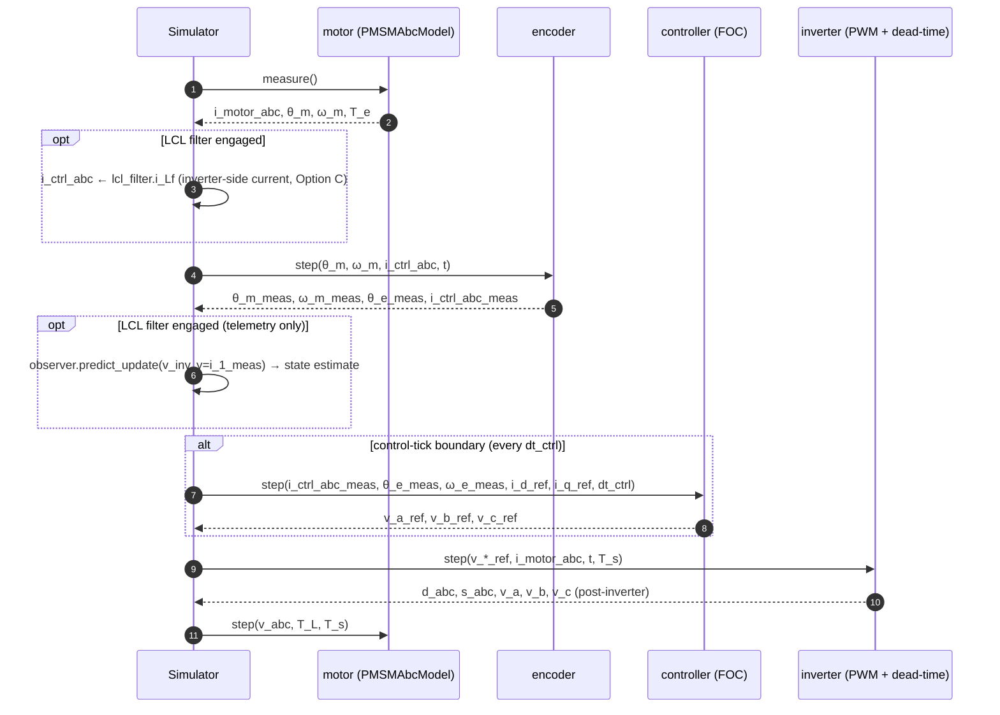
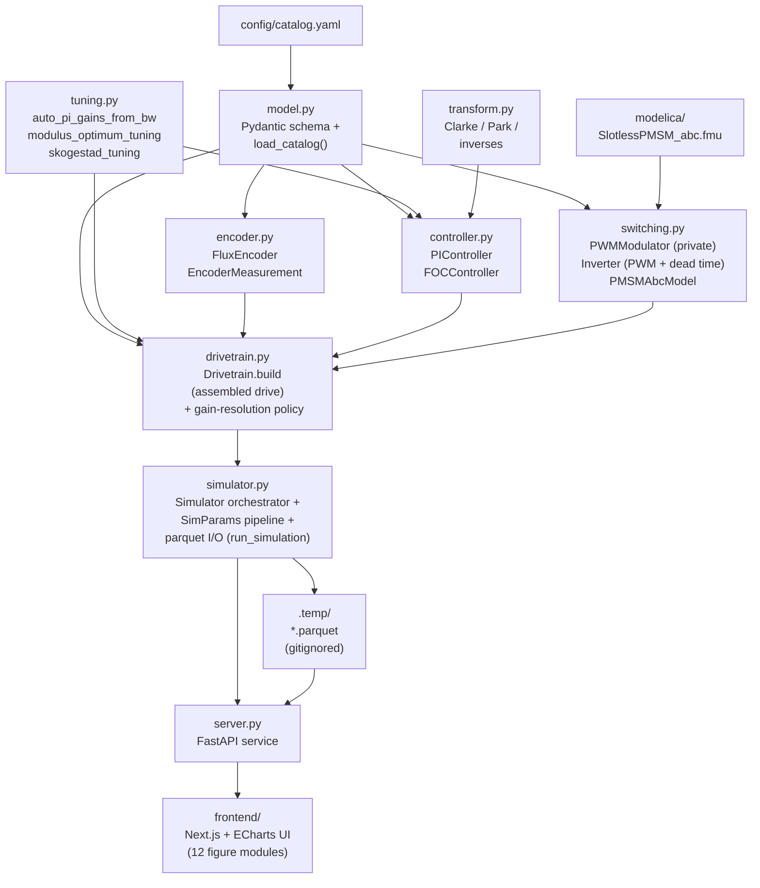

# slimtorq-control

Python-side **Field-Oriented Control (FOC)** for an OpenModelica slotless-PMSM
motor model, with a real **PWM + inverter** in the loop, dead-time emulation,
selectable PWM modulation (sine / SVPWM / DPWMMAX / DPWMMIN / DPWM1 / auto
hybrid), optional **LCL output filter** between inverter and motor (component
values derived from a cutoff target), modulus-optimum / pole-zero-cancellation
current-loop tuning, and a single-container web UI: a **FastAPI** Python
service exposing the simulator over HTTP at `/api/*` and serving a prebuilt
**Next.js + Apache ECharts** static bundle at `/` for the 12 diagnostic plots.

The motor is parameterised from [config/catalog.yaml](config/catalog.yaml) against the Alva
**SlimTorq** lineup (9 families × ~12 winding configurations ≈ 86 entries).

## Architecture

One container, one port. FastAPI hosts `/api/*` (the simulator) and `/`
(the static Next.js bundle). The React app POSTs a 32-field `SimParams`
JSON, gets metadata back, fetches the trace as Apache Arrow IPC, and
renders 12 ECharts figures client-side. Parquet artifacts (with
`slimtorq.*` metadata) remain the canonical persistence — external
consumers (polars, duckdb, …) read them unchanged.

```mermaid
flowchart LR
    subgraph Frontend["Browser — Next.js static bundle"]
        direction TB
        F1["ConfigPanel<br/>(32 react-hook-form inputs)"]
        F1 -->|"POST /api/simulate"| F2
        F2["lib/api.ts<br/>Arrow IPC decode"]
        F2 --> F3["PlotPanel<br/>12 ECharts modules"]
    end

    subgraph API["src/api.py — FastAPI (single process, port 8000)"]
        direction TB
        STATIC["StaticFiles('/' → frontend/out)"]
        A1["POST /api/simulate → SimParams<br/>blake2b hash + run_simulation()"]
        A1 --> A2["simulator.run_simulation"]
        A2 --> A3["write_parquet (slimtorq.* metadata)"]
        A4["GET /api/simulate/{hash}/data → Arrow IPC"]
        A5["GET /api/catalog · /api/defaults · /api/artifacts/{hash}.parquet"]
    end

    subgraph Pipeline["Simulator — orchestrates per-tick signal flow"]
        direction LR
        TL["TL_ref(t)"] --> C
        C["controller<br/>(FOCController)<br/>Clarke → Park → 2× PI on i_1<br/>→ dq decoupling + BEMF FF<br/>→ (K_d·ic_hat path — off by default; see memo.md §4)<br/>→ vector sat → InvPark → InvClarke"]
        C -->|"v_a_ref, v_b_ref, v_c_ref"| I
        I["inverter<br/>(PWM + dead-time)"]
        I -->|"v_a, v_b, v_c"| M
        M["motor<br/>PMSMAbcModel (FMU)"]
        M -->|"i_abc, θ_m, ω_m, T_e"| E
        E["encoder<br/>EncoderMeasurement<br/>θ_e_meas = p · θ_m_meas mod 2π"]
        E -->|"i_abc_meas, θ_e_meas, ω_e_meas"| C
    end

    Frontend -.-|"HTTP + Arrow IPC"| API
    API -.-|"builds + drives"| Pipeline
```



**Clocks.** Two outer clocks plus one inside the encoder:

- `T_s` — inner simulation step (FMU `doStep`, PWM carrier comparison, inverter dead-time tracking). Default `T_pwm/20`; a `T_s ≤ T_pwm/10` floor in `Simulator.run` enforces ≥10× oversampling of the carrier.
- `dt_ctrl = 1 / controller.f_pwm` — FOC current-loop tick (one FOC update per PWM cycle, the standard digital-FOC convention).
- `Ts_enc` — encoder sample period, lives inside `FluxEncoder`.

The PWM modulator is owned by the `Inverter` — `Inverter.step()` does PWM compare + dead-time-aware leg voltages in one call. Between FOC ticks the FOC's last `v_abc_ref` is held by ZOH and fed into the inverter every `T_s`.

**Sampling phase.** `Simulator.run(sampling_phase=...)` picks when in the PWM cycle the FOC samples the current:

- **`"valley"`** (default) — FOC tick at every carrier valley (`t = T_pwm, 2·T_pwm, …`).
- **`"midpoint"`** — single sample at every carrier peak (`t = T_pwm/2, …`). Equivalent to valley for sine PWM with a linear in-period ramp.
- **`"double"`** — snapshot at the carrier peak, averaged with the valley sample at the FOC tick. Cancels the linear in-period ramp exactly and rejects dead-time-induced edge asymmetry — the textbook production technique. Pinned ~25% peak-to-peak `i_q` ripple drop on the 2D winding vs single-sample modes (see [tests/test_sampling_phase.py](tests/test_sampling_phase.py)).

## Physical effects modelled

Why this architecture (and not the simpler "FOC outputs continuous v_abc straight to the motor"):

| Effect | Where it's modelled | What you see |
|---|---|---|
| **Switching ripple** in i_abc at f_pwm | Naturally — `Inverter` emits square ±Vdc/2 phase voltages; FMU integrates them. | Triangular ripple of amplitude `≈ Vdc·T_pwm/(8·L_s)` on top of the fundamental current. Drives iron losses, EMI, audible noise, current-sensor bandwidth. |
| **Dead time** (1–3 µs gate-driver blanking) | `Inverter` tracks per-leg t_since_edge; during the t_dead window, freewheel diode clamps v_k = −sign(i_k)·Vdc/2. | 5th + 7th harmonic distortion in i_abc; small low-frequency torque ripple FOC's integrator absorbs. Set `t_dead = 0` to disable. |
| **Vdc utilisation limit** (sinusoidal-PWM linear range `\|v_phase\| ≤ Vdc/2`) | `FOCController` clips `(v_d, v_q)` to magnitude `V_max = Vdc/2` *before* inverse Park. Anti-windup freezes both integrators when the vector saturates. | Beyond the envelope, achievable torque plateaus; the PI-performance plot's `\|v_dq\|` trace clamps at the red line. |
| **dq cross-coupling + BEMF** (`−ω_e·L_s·i_q` on d-axis; `+ω_e·L_s·i_d + ω_e·λ_PM` on q-axis) | `FOCController` adds them as feedforward to the raw PI output (so the per-axis plant the PI sees collapses to a pure R/L circuit; vector saturation acts on the combined PI + FF command). | At high speed the BEMF term `ω_e·λ_PM` dominates v_q; without feedforward the PI integrator absorbs it with tracking lag. With feedforward, i_q tracks immediately and the integrator only handles modelling error. |

## One tick of the inner loop



Between FOC ticks the v_*_ref values are held by ZOH and fed into the inverter every `T_s`, so the power stage runs at the carrier-resolution timescale while the FOC integrates only once per PWM period.

**FOC feedback signal — `i_motor` vs `i_1`.** When the LCL filter is engaged the Simulator sources the FOC's feedback current from `LCLFilter.i_Lf` (the inverter-side current, `i_1`) instead of the FMU's motor-side current. This places the LCL resonance *downstream* of the closed loop — outside it — so the PI cannot excite the resonance and the observer-driven active damping is no longer needed. With no LCL, the simulator falls back to motor-side current as before. The architectural rationale and the discrete-time anti-damping artifact at `f_pwm/2` that motivated this choice are documented in [memo.md §4](memo.md). In hardware this corresponds to placing Hall sensors between the inverter FETs and `L_f` — standard industrial practice for LCL-equipped drives.

## Modules



| File | Role |
|---|---|
| [modelica/Alva.mo](modelica/Alva.mo) | `SlotlessPMSM_abc`: surface-PM motor, abc external interface, dq internal dynamics on the **true** rotor angle, optional 6th-electrical-harmonic torque ripple. |
| [modelica/build_fmu.mos](modelica/build_fmu.mos) | `omc` build script producing `SlotlessPMSM_abc.fmu`. |
| [config/catalog.yaml](config/catalog.yaml) | Nested family → variant → winding data. Every cell is `{unit, value}` so units are explicit. |
| [src/model.py](src/model.py) | All Pydantic v2 models — catalog-parsing schema, the `MotorSku` + `decode_sku` serial decoder (catalog REV1.8 p.28), the `CatalogMotor` connection-aware computed-field bridge (R_s / L_s / λ_PM / J per p.35), the simulation-facing flat types (`PmsmModel`, `EncoderConfig`, `FocConfig`, `InverterConfig`, `TLRef`), and the catalog loader. `python -m src.model` exercises the decoder, prints the STM-75-20-L-4Y worked example, then cross-checks every variant against its catalog continuous-torque. |
| [src/tuning.py](src/tuning.py) | Plant-aware PI tuning. Each rule (`auto_pi_gains_from_bw`, `modulus_optimum_tuning`, `skogestad_tuning`) accepts a `plant_type ∈ {lr, lcl_conservative, lcl_with_active_damping}` and returns a `PITuningResult` dataclass with gains + diagnostics (including the optional `Kd` field used by the LCL-with-active-damping path). LR uses `(R_s, L_s)`; LCL modes use the low-frequency equivalent `(L_eq, R_eq) = (L1 + Lload, R1 + Rload)` and reject the tuning if the implied closed-loop bandwidth gets too close to the LCL resonance (`ω_bw > ω_res / margin`, default margin 10 conservative / 5 with active damping) or to the PWM frequency (`f_bw > f_pwm / 10`). The drivetrain auto-routes to `"lcl_with_active_damping"` when `filter_enabled=True`; the active-damping `K_d` is computed analytically in `drivetrain._auto_tune` from `SimParams.zeta_target`. |
| [src/observer.py](src/observer.py) | Single-axis Luenberger state observer for the LCL plant `x = [i1, vc, im]^T`. Forward-Euler discrete update. **Observer gain `L` is pole-placed** via `compute_observer_gain(A, C, pole)` — Ackermann's formula on the dual `(A^T, C^T)`, all three observer poles coincident-real at `−α·ω_res`. `α` (= `SimParams.observer_pole_multiplier`, default 3) is the speed-vs-noise dial. Three measurement modes (`motor_current`, `inverter_current`, `capacitor_voltage`). Reused per dq axis — `Simulator` instantiates one `LCLObserver` for d and one for q when the LCL filter is engaged in switching mode. The estimated capacitor current `ic_hat = i1_hat - im_hat` is consumed by `FOCController` as the active-damping signal (see below). `python -m src.observer` runs a smoke test. |
| [src/transform.py](src/transform.py) | Amplitude-invariant Clarke / Park + composed `abc_to_dq`, `dq_to_abc`. `python transform.py` round-trip self-test. |
| [src/controller.py](src/controller.py) | `PIController` (parallel-form PI with split unsaturated/integrate API for shared anti-windup), `FOCController` (Clarke → Park → 2× PI → **dq decoupling + BEMF feedforward** → **active damping** (`−K_d · ic_d_hat`, `−K_d · ic_q_hat`) → **vector saturation** → InvPark → InvClarke). The active-damping term is zero when no LCL is engaged. Exposes `f_pwm` so the Simulator can derive `dt_ctrl`. |
| [src/encoder.py](src/encoder.py) | `FluxEncoder` (sample-and-hold + 3-harmonic cyclic error + N-bit quantization), `EncoderMeasurement` (composite wrapper adding `θ_e_meas` + i_abc pass-through). |
| [src/switching.py](src/switching.py) | `PWMModulator` (centered triangular-carrier compare with selectable zero-sequence injection: sine / svpwm / dpwmmax / dpwmmin / dpwm1 / auto-hybrid), `Inverter` (PWM compare + gate-driver dead-time via freewheel-diode model — one `step()` does both), `LCLFilter` (optional per-phase Python-side LCL low-pass between inverter terminals and motor, integrated by forward Euler at the simulator's inner step), `PMSMAbcModel` (thin FMU wrapper). |
| [src/drivetrain.py](src/drivetrain.py) | `Drivetrain` — the assembled closed-loop drive (motor + FOC controller + inverter + encoder + optional LCL filter). `Drivetrain.build(SimParams, PmsmModel)` is the canonical factory: it resolves every motor-aware derivation in one place — `Vdc = resolve_vdc(p, motor)` (default `1.5 · motor.rated_voltage`; override via `SimParams.vdc`), LCL components from `FilterConfig.derive_components(motor.L_s, fc)`, FOC gains via `_resolve_gains(p, motor)` returning a `(K_p, K_i, K_d)` triple — pi_mode-selected Skogestad / Modulus Optimum on the LR plant when no LCL, **Skogestad + analytic `K_d`** for the LCL path (`K_d = 2·ζ·√(L_total/C_f) − (R_1 + R_d_passive)` to damp the resonance to `SimParams.zeta_target`). Carries `observer_pole_multiplier` for the simulator. Context-managed — owns the FMU resource and releases it on exit. |
| [src/simulator.py](src/simulator.py) | Two layers. (1) `Simulator(drive)` — the multi-rate orchestrator. Takes a fully-built `Drivetrain`; `sim.run(TL_ref, T_s, T_f, sampling_phase)` drives the multi-rate loop (`T_s` inner, `dt_ctrl = 1/f_pwm` for FOC, `Ts_enc` inside the encoder) and returns a `polars.DataFrame`. The LCL observer runs **before** the FOC tick using current dq measurements (zero-cycle delay) so `ic_hat` is in-phase with the resonance. (2) `run_simulation(SimParams) -> (df, SimMeta)` — the headless pipeline: canonical-params blake2b hashing, `write_parquet` with `slimtorq.*` metadata, tracking-error + ripple stats on `SimMeta` (`iq_ripple`, `te_ripple`, `ia_ripple` — the last computed over sliding ~2-PWM-period windows to isolate PWM ripple from the rotating fundamental). Catalog loaded at import (`CATALOG: dict[str, PmsmModel]`). Idiom: `with Drivetrain.build(p, motor) as drive: sim = Simulator(drive); df = sim.run(...)`. |
| [src/server.py](src/server.py) | FastAPI app + uvicorn server. `get_app()`/`get_server()` are cached lazily; `run()` awaits `serve()`. `get_server` passes the app as an import-string with `factory=True` so the `app.reload` flag in [config/config.yaml](config/config.yaml) is honoured. Routes: `GET /health · /catalog · /defaults`, `POST /simulate` (returns `SimMeta` JSON), `GET /simulate/{hash}/data` (Apache Arrow IPC stream of the trace), `GET /artifacts/{hash}.parquet` (raw parquet download). CORS allow-list comes from [config/config.yaml](config/config.yaml). |
| [src/main.py](src/main.py) | Async entrypoint: `asyncio.run(server.run())`. |
| [frontend/](frontend/) | Next.js (App Router) + Apache ECharts UI. `app/page.tsx` composes `<ConfigPanel>` (32 react-hook-form inputs in sections: motor / inverter / LCL / encoder / trajectory / timing / PI / debug) and `<PlotPanel>` (12 figure modules under `components/PlotPanel/figures/`: tracking, piPerformance, vdqRoundtrip, iqZoom, iqFft, omegaFft, phaseCurrents, iabcFft, phaseVoltages, duties, encoderError, speedAndSaturation). `lib/api.ts` POSTs `/simulate` and fetches the Arrow trace; `lib/arrow.ts` exposes typed-array column accessors; `lib/fft.ts` runs the rFFT for the three spectrum figures; `lib/palette.ts` mirrors the three Alva CSS variables (`#1A1A1A`, `#E0543F`, `#5B5B5B`). Figure titles use KaTeX. |

## Equations

**Clarke / Park** (amplitude-invariant 3 → 2)

```
v_α = (2/3)·(v_a − 0.5·v_b − 0.5·v_c)
v_β = (1/√3)·(v_b − v_c)
v_d =  cos(θ_e)·v_α + sin(θ_e)·v_β
v_q = −sin(θ_e)·v_α + cos(θ_e)·v_β
```

**dq stator dynamics** (L_d = L_q = L_s for slotless surface-PM)

```
v_d = R_s·i_d + L_s·di_d/dt − ω_e·L_s·i_q
v_q = R_s·i_q + L_s·di_q/dt + ω_e·L_s·i_d + ω_e·λ_PM
```

**dq decoupling + BEMF feedforward** (added to the raw PI output, before vector saturation, so each PI sees a pure R/L plant)

```
ff_d = −ω_e_meas · L_s · i_q_meas
ff_q =  ω_e_meas · L_s · i_d_meas + ω_e_meas · λ_PM
v_d_raw = PI_d + ff_d
v_q_raw = PI_q + ff_q
```

**Vector saturation** before inverse Park

```
|v_dq|² > V_max² = (Vdc/2)²  ⇒  scale (v_d, v_q) by V_max/|v_dq|
                                  freeze both PI integrators
```

**PI tuning rules** (all three ship in [src/tuning.py](src/tuning.py), each selectable by `plant_type`)

For `plant_type="lr"` (LCL filter disabled — the LR motor plant):

```
auto / pole-zero cancellation:   K_p = L_s·2π·bw_hz,   K_i = R_s·2π·bw_hz
modulus optimum (T_σ = 1.5/f_pwm):  K_p = L_s·f_pwm/3,   K_i = R_s·f_pwm/3
Skogestad SIMC (τ = 1.5/f_pwm, default T_c = τ):
    K_p = L_s / (T_c + τ),  T_i = min(L_s/R_s, k1·(T_c + τ)),  K_i = K_p / T_i
    (k1 = 1.44 default; k1 = 4 for textbook critically-damped disturbance step)
```

For `plant_type ∈ {"lcl_conservative", "lcl_with_active_damping"}` (LCL filter enabled), the same formulae are applied with `(L_s, R_s) → (L_eq, R_eq)` where

```
L_eq = L1 + Lload     R_eq = R1 + Rload
ω_res = sqrt((L1 + Lload) / (L1 · Lload · Cf))
```

and the tuning raises `ValueError` if the implied closed-loop bandwidth violates the resonance gate `ω_bw ≤ ω_res / margin` (default margin **10** conservative, **5** with active damping) or the PWM gate `f_bw ≤ f_pwm / 10`. The drivetrain auto-derives `plant_type` from `FilterConfig.enabled` and uses the `lcl_with_active_damping` margin (5) — justified because **the active-damping loop is closed**: `FOCController` subtracts `K_d · ic_hat` (per axis) from `v_dq_ref` before vector saturation, with `K_d` chosen analytically to place the LCL resonance damping ratio at `SimParams.zeta_target` (default 0.7).

**Active-damping `K_d` formula** (analytic, virtual-resistor across the LCL capacitor):

```
L_total = (L_1 · L_load) / (L_1 + L_load)
K_d     = max(0, 2·ζ_target·√(L_total/C_f) − (R_1 + R_d_passive))
```

`R_d_passive = √(L_f/C_f)` is the passive damping baked into `FilterConfig.derive_components`, sized so it alone delivers ζ ≈ 0.7 on the LCL resonance — at which point the analytic `K_d` collapses to 0 and active damping is effectively disabled. The historical value (`/ 3`) under-damped the resonance and required AD to compensate; AD then introduced a ZOH anti-damping artifact at Nyquist (`f_pwm/2`) which is documented in [memo.md §4](memo.md). The current value matches what AD's `K_d` was synthesising but does so with a real resistor and no discrete-time phase hazard.

**LCL state observer** ([src/observer.py](src/observer.py)). Single-axis Luenberger:

```
x_hat_dot = A x_hat + B v_inv + E e + L (y_meas − C x_hat)         (Euler, dt = T_s)

A = [[−R1/L1, −1/L1,            0   ],
     [ 1/Cf,   0,            −1/Cf  ],
     [ 0,     1/Lload, −Rload/Lload ]]
B = [1/L1, 0, 0]^T          E = [0, 0, −1/Lload]^T
```

Two instances run in the dq frame when the LCL filter is engaged (one per axis, fed by `(v_d, i_d_meas)` and `(v_q, i_q_meas, ω_e·λ_PM)`); the estimated capacitor current `ic_hat = i1_hat − im_hat` is **injected by `FOCController` as `v_damp = −K_d · ic_hat`** (per axis) before vector saturation, with `K_d` from the analytic damping-ratio formula above. The observer runs *before* the FOC tick inside `Simulator.run` (zero-cycle delay) so `ic_hat` is in-phase with the resonance — a 1-cycle delay would amplify rather than damp the resonance at typical `f_pwm` / `f_res` ratios. Surfaced in the UI as the **Observer** plot tab (gated on `filter_enabled`).

**Observer gain `L`** is pole-placed via Ackermann's formula on the dual `(A^T, C^T)`, with all three poles coincident-real at `−α·ω_res` (`α = SimParams.observer_pole_multiplier`, default 3). `compute_observer_gain(A, C, pole)` in `src/observer.py` does the algebra; the simulator calls it once per run and passes the resulting `L` into both d- and q-axis observers.

**LCL filter design** (`FilterConfig.derive_components(L_s, f_c)`):

```
L_f = L_s                        (matched-inductance, f_res ≈ √2·f_c)
C_f = 1 / ((2π·f_c)² · L_f)
R_d = √(L_f/C_f)                 (passive damping; sized for ζ ≈ 0.7 directly — no AD needed)
```

**Centered sinusoidal PWM**

```
d_k = clip(0.5 + v_k_ref / Vdc, 0, 1)               k ∈ {a, b, c}
s_k = 1 if d_k > carrier(t) else 0                  triangle, period T_pwm
```

**Inverter output** (sign(i_k) is the post-FMU measured current direction)

```
outside dead time:   v_k = (s_k − 0.5) · Vdc
inside  dead time:   v_k = −sign(i_k) · Vdc/2       (freewheel diode)
```

**Electromagnetic torque** (with optional 6th-electrical-harmonic ripple)

```
T_e_dq = 1.5 · p · λ_PM · i_q
T_e    = T_e_dq · (1 + ripple_pct · sin(6·θ_e + φ_ripple))
```

**Mechanical**

```
J · dω_m/dt = T_e − T_L − B·ω_m
dθ_m/dt = ω_m
```

**Torque → current ref** (surface-PM ⇒ i_d_ref = 0)

```
i_q_ref = T_e_ref / (1.5 · p · λ_PM)
```

## Motor serial decoding (catalog REV1.8 p.28)

Every SlimTorq motor is identified by a nine-segment serial number
(`MotorSku` + `decode_sku` in [src/model.py](src/model.py)):

```
STM-130-27-L-4Y-A-18A-A0-001
 │   │   │  │  │  │  │   │  │
 │   │   │  │  │  │  │   │  └── unique_id     3 digits
 │   │   │  │  │  │  │   └───── sensor        Temp + Position (A–Z, "0" = none)
 │   │   │  │  │  │  └───────── cable         AWG(1-99) + Type(A–Z)
 │   │   │  │  │  └──────────── terminal      A = Axial / R = Radial
 │   │   │  │  └─────────────── winding       series_turns + Y(star) / D(delta)
 │   │   │  └────────────────── variant       L = Lite / M = Max
 │   │   └───────────────────── axial_length  Stator length (mm)
 │   └───────────────────────── stator_od     Stator OD (mm)
 └───────────────────────────── series        STM = SlimTorq Motor
```

The short five-segment form (`STM-75-20-L-4Y`) is the catalog key and the
filename stem for cached parquets in `.temp/` (gitignored). The
winding code's connection letter (`Y` vs `D`) drives the phase-impedance
decomposition below.

## Datasheet → dq conversions (catalog REV1.8 p.35)

Catalog values are line-to-line and Arms-referenced. `CatalogMotor` in
[src/model.py](src/model.py) derives each phase-domain parameter as a
`@computed_field` whose docstring carries the page-35 formula:

```
                                  ┌─ Star  (Y):  R_phase = 0.5 · R_LL
R_s  [Ohm]   ── from R_LL   ──────┤
                                  └─ Delta (D):  R_phase = 1.5 · R_LL

                                  ┌─ Star  (Y):  L_phase = 0.5 · L_LL · 1e-6
L_s  [H]     ── from L_LL_uH ─────┤
                                  └─ Delta (D):  L_phase = 1.5 · L_LL · 1e-6

λ_PM  [Wb]    = K_T / (1.5 · p · √2)        amp-inv Clarke ⇒ i_q_peak = √2·I_q_rms
J    [kg·m²] = J_gcm² · 1e-7
p            = common.pole_pairs
Vdc  [V]     = 1.5 · motor.rated_voltage (default; SimParams.vdc to override)
```

Worked example — **STM-75-20-L-4Y** (Star, 4 series turns, Lite):
`R_LL=0.457 Ω, L_LL=15.4 µH, K_T=0.109 Nm/Arms, p=18, J_gcm²=620` →
`R_s=0.2285 Ω, L_s=7.7 µH, λ_PM=2.85 mWb, J=6.2e-5 kg·m²`.

**Note — Delta windings.** Phase impedance is the physical winding value
(`1.5·R_LL`, `1.5·L_LL`), not a Y-equivalent transform. This is the literal
page-35 definition; if a future revision of the dq sim wants star-equivalent
quantities for delta motors, that conversion belongs downstream of
`CatalogMotor`, not inside its derivations.

## Getting started

The fastest path is the **prebuilt Docker image** — no Python, no `uv`, no
OpenModelica toolchain on the host. Use the source-build path only if you
plan to edit the code or rebuild the Modelica plant.

### Option A — Docker (recommended, one call)

The whole app (FastAPI + the static Next.js bundle + the FMU) ships as one
image on Docker Hub:
[`phillipmaree/slimtorq-control`](https://hub.docker.com/r/phillipmaree/slimtorq-control).

```bash
docker compose up
# → open http://localhost:8000
```

That single command pulls (or builds) the image, mounts a named volume for
parquet artifacts, and starts the service. No frontend toolchain or Python
on the host.

### Configuration

All runtime configuration lives in [config/config.yaml](config/config.yaml):

```yaml
app:        { name, host, port, version, log_config_file, log_level }
cors:       { allow_origins, allow_methods, allow_headers }
frontend:   { dist_dir }     # static Next.js export
artifacts:  { dir }          # parquet output directory
catalog:    { path }         # motor catalog YAML
```

Logging is a standard `dictConfig` in
[config/logging.yaml](config/logging.yaml). The container image bakes both
files in and overrides only the container-specific paths
(`ARTIFACTS__DIR=/data/artifacts`, `FRONTEND__DIST_DIR=/app/frontend/out`)
through env. Any field can be overridden by env with the double-underscore
delimiter — `APP__PORT=9000`, `CATALOG__PATH=/custom/catalog.yaml`, etc.
Image publishing is automated by
[`.github/workflows/docker-publish.yml`](.github/workflows/docker-publish.yml).
That workflow has two jobs: a `test` job (pytest) that runs on every push
and PR, and a `build` job that depends on `test` and builds + publishes the
image. The image is only pushed to Docker Hub for
pushes to `main` or `v*` tags; other branches and PRs build to validate but
do not publish. Tests must pass before the build job starts. The aspirational
ripple test ([tests/test_ripple_below_one_pct.py](tests/test_ripple_below_one_pct.py))
is excluded from CI — it intentionally fails until the headline <1% PWM-band
ripple target lands.

### Option B — From source (for development)

Requires `uv` (Python toolchain), Node.js 20+, and `omc` (OpenModelica
compiler) on the host.

```bash
# 0. Sync deps.
uv sync
(cd frontend && npm install)

# 1. Build the FMU (requires OpenModelica `omc`).
(cd modelica && omc build_fmu.mos)

# 2a. Single-process dev (rebuild the static bundle, let FastAPI serve it).
(cd frontend && npm run build)
uv run python -m src.main
# → http://localhost:8000
#   (or for hot-reload, drive uvicorn directly:
#    uv run uvicorn --factory src.server:get_app --reload --port 8000)

# 2b. Or run with HMR: two terminals, NEXT_PUBLIC_API_BASE points the dev
#     server at uvicorn. Copy frontend/.env.example to frontend/.env.local.
uv run uvicorn --factory src.server:get_app --reload --port 8000
cd frontend && npm run dev
# → http://localhost:3000 (HMR), API on http://localhost:8000

# 3. Catalog cross-check (optional).
uv run python -m src.model
```

Each `/api/simulate` POST runs a fresh sim from scratch and writes the
trace to `<artifacts.dir>/<family>_<variant>.parquet` (defaults to
`.temp/` from [config/config.yaml](config/config.yaml); the container image
points it at `/data/artifacts`). The parquet's key-value metadata holds
the 16-character blake2b hash of the canonical input dict for
traceability; there is no cache-hit path.

## Output schema (parquet v2)

| Column group | Names | Type |
|---|---|---|
| Time | `t` | float |
| References | `TL_ref`, `i_d_ref`, `i_q_ref`, `v_d_ref`, `v_q_ref`, `v_a_ref`, `v_b_ref`, `v_c_ref` | float |
| Measurements | `T_e`, `i_d_meas`, `i_q_meas`, `i_a`, `i_b`, `i_c`, `θ_m_true`, `θ_m_meas`, `ω_m_true`, `ω_m_meas` | float |
| PWM | `d_a`, `d_b`, `d_c` | float |
| Switching | `s_a`, `s_b`, `s_c` | int8 |
| Post-inverter | `v_a`, `v_b`, `v_c` | float |
| LCL observer (NaN when filter disabled) | `i1_d_hat`, `vc_d_hat`, `im_d_hat`, `ic_d_hat`, `i1_q_hat`, `vc_q_hat`, `im_q_hat`, `ic_q_hat` | float |
| Active-damping voltage | `ad_d`, `ad_q` (= `−K_d · ic_*_hat`; zero when no LCL) | float |
| Saturation flags | `sat_d`, `sat_q` | bool |

Metadata (`slimtorq.*` keys): `schema_version`, `params_hash`, `params_json`, `foc_kp`, `foc_ki`, `pi_mode`, `pi_tc`, `pi_k1`, `vdc`, `f_pwm`, `t_dead`, `ts_enc`, `inverter_mode`, `pwm_mode`, `filter_enabled`, `filter_fc`, `filter_lf`, `filter_cf`, `filter_rd`, `b_est`, `motor_family`, `motor_name`, `motor_rated_voltage`, `r_s`, `l_s`, `pole_pairs`, `i_q_peak`, `te_peak_1s`.

In addition, `SimMeta` (returned by `POST /api/simulate` and visible in the Header) carries **ripple statistics** computed over the steady-state tail (last 25% of the run): `iq_ripple`, `te_ripple`, `ia_ripple`, each a `{delta_pp, pct_rated, pct_cmd}` record. `ia_ripple` uses a windowed peak-to-peak (max pp inside any ~2-PWM-period sliding window) so the rotating fundamental doesn't dominate the metric. The full canonical `SimParams` JSON (including `vdc`, `zeta_target`, `observer_pole_multiplier`) is stashed verbatim under `slimtorq.params_json`.

## Practical-drive ripple target

[tests/test_ripple_below_one_pct.py](tests/test_ripple_below_one_pct.py) pins a **<1 % windowed PWM-band ripple** target for the 2D and 8D windings of the STM-105-17 chassis using a fully documented industrial-SiC configuration (`f_pwm = 150 kHz`, `t_dead = 200 ns`, `pwm_mode = svpwm`, `sampling_phase = double`, LCL filter at `fc = 22.5 kHz`, `ζ = 0` so passive `R_d = √(L_f/C_f)` damps the resonance directly, FOC closed on inverter-side current `i_1`). Every knob is bounded by the `PracticalEnvelope` dataclass — the parameter-validation tests guard the configuration against drifting outside what a real medium-power SiC drive can build. The 8D winding currently lands around 11 % after the Option C refactor; the 2D winding's ultra-low `L_s = 2.6 µH` keeps it ripple-bound at ~43 % even at the upper edge of the envelope, so the headline assertion fails honestly and prints the achieved-vs-target gap as the next iteration's starting point. The full diagnosis chain (why `<1 %` is *currently* unreachable, what changed in the architecture, and what would close the remaining gap) is in [memo.md §4](memo.md).

## Repo layout

```
slimtorq-control/
├── README.md
├── docker-compose.yaml                single service: FastAPI on :8000 serving /api/* + the Next.js static bundle at /
├── compose/control/
│   ├── Dockerfile                     multi-stage: node builder (Next.js export) → python:3.13-slim runtime
│   └── start                          python -m src.main
├── .github/workflows/
│   └── docker-publish.yml             pytest gate, then build + push phillipmaree/slimtorq-control
├── config/
│   ├── config.yaml                    server / cors / frontend / artifacts / catalog
│   ├── logging.yaml                   logging.dictConfig schema
│   └── catalog.yaml                   Alva SlimTorq motor data
├── pyproject.toml                     deps: fmpy, polars, fastapi, uvicorn, pyarrow, pydantic-settings, …
├── modelica/
│   ├── Alva.mo
│   ├── build_fmu.mos
│   └── SlotlessPMSM_abc.fmu           built artifact (regenerable)
├── .temp/<fam>_<var>.parquet         most recent run, overwritten each Simulate (gitignored)
├── src/                              python -m src.<module>   (package)
│   ├── __init__.py                    Pydantic-Settings loader over config/config.yaml (singleton get_config())
│   ├── main.py                        async entrypoint (await server.run())
│   ├── server.py                      FastAPI app + uvicorn.Server (get_app / get_server / run)
│   ├── model.py                       Pydantic schema + catalog loader
│   ├── tuning.py                      plant-aware PI tuning (LR + LCL conservative + LCL with active damping)
│   ├── observer.py                    single-axis Luenberger LCL state observer (Ackermann pole placement; used 2× for dq)
│   ├── transform.py                   Clarke / Park / inverses
│   ├── controller.py                  PIController, FOCController (Clarke→Park→PI→FF→AD→vec-sat→InvPark→InvClarke)
│   ├── encoder.py                     FluxEncoder, EncoderMeasurement
│   ├── switching.py                   PWMModulator (6 modes), Inverter (PWM + dead time), LCLFilter, PMSMAbcModel
│   ├── drivetrain.py                  Drivetrain (assembled drive) + _auto_tune (Kp, Ki, Kd) + Vdc / pole-multiplier resolution
│   └── simulator.py                   Simulator orchestrator + sampling_phase + run_simulation(SimParams) → df + SimMeta + parquet
└── frontend/
    ├── package.json                   next, react, react-hook-form, echarts, apache-arrow, katex
    ├── app/                           layout + single-page UI
    ├── components/
    │   ├── ConfigPanel/               32 react-hook-form inputs (motor / inverter / filter / encoder / trajectory / timing / PI / debug)
    │   ├── PlotPanel/                 12 ECharts figure modules under figures/*.ts
    │   └── Header.tsx                 logo + status pill (artifact name, hash, err %, Kp/Ki)
    ├── lib/                           api.ts (Arrow IPC fetch) · arrow.ts (column accessors) · fft.ts · tuning.ts · palette.ts
    └── types/sim.ts                   SimParams / SimMeta / Variant (mirror of Pydantic models)
```
